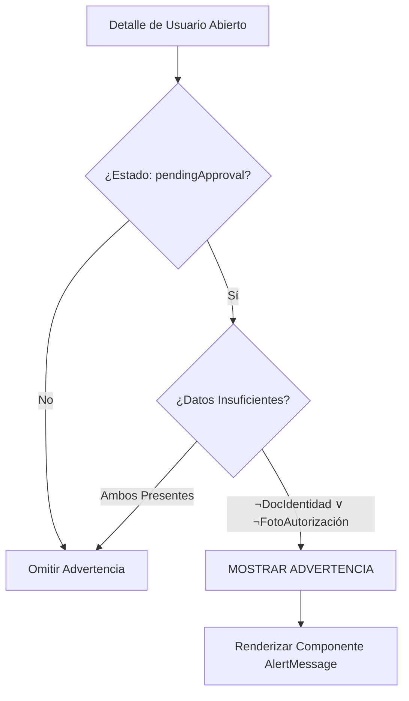

# Reporte de Avance: TEC-495 - Advertencia de Aprobación de Huésped

## Flujo Lógico de Decisión

## Especificación Técnica de Lógica de Negocio

La activación de la advertencia de identidad se rige por la siguiente función lógica formal:

Sea $f(x)$ la función que determina la visibilidad del componente, donde:
- $S$: Estado del usuario es 'pendingApproval'.
- $C$: La propiedad cuenta con la configuración de alertas activa.
- $D$: El usuario posee un documento de identidad cargado.
- $P$: El usuario posee una foto de autorización cargada.

$$f(x) = S \land C \land (\neg D \lor \neg P)$$

**Secuencia de Ejecución:**
1. Verificación de pre-condición de estado ($S$).
2. Validación de flag de activación por identificador de propiedad ($C$).
3. Evaluación de disyunción de ausencia de registros documentales ($\neg D \lor \neg P$).

## Especificación Estética de Interfaz

Se ha implementado el componente `AlertMessage` bajo los siguientes parámetros de diseño institucional:

1. **Efecto Visual**: Faded (Degradado secundario).
    - **Fondo**: Linear Gradient (warning-50 → background).
    - **Contorno**: Borde sólido de 2px (warning-500).
2. **Iconografía**:
    - **Elemento**: Warning2 (Estilo Bold).
    - **Dimensión**: 32px.
3. **Geometría**:
    - **Radio de curvatura**: rounded-large (2rem).
    - **Ancho**: Ajuste automático al 100% del contenedor padre.

## Evidencia de Implementación
> [!IMPORTANT]
> **Insertar captura de pantalla aquí:**
> `![[TEC-495-vista-previa.png]]`

---
**Estado**: Listo para QA
**Identificadores de Commit**: `af99666`, `c5626cc`
