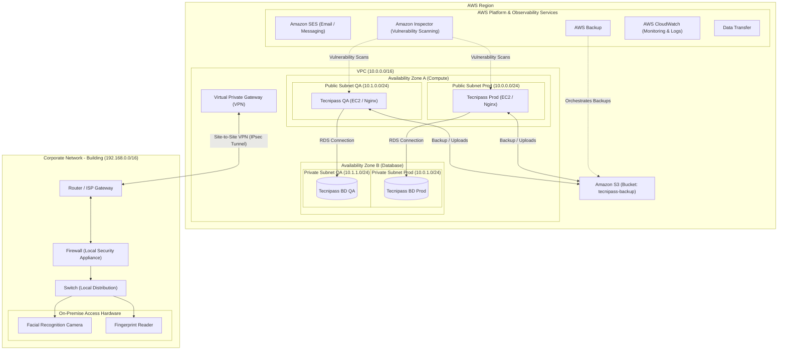

# Cloud Infrastructure & AWS Architecture Specification

This document defines the cloud infrastructure topology, service integrations, security parameters, and network layouts for the TecniPass platform, based on the Assure IT technical proposal (`Propuesta_Tecnipass_3.pdf`). It guides agents and engineers in deploying, configuring, and maintaining the cloud environment.

## Infrastructure Topology Diagram

The following diagram illustrates the AWS cloud layout, environment separation (QA & Production) across availability zones, auxiliary AWS services, and the Site-to-Site VPN bridge to the physical building's corporate network.



---

## Rules & Guidelines

### 1. Multi-Environment & Resource Isolation
- **QA & Production Segregation**:
  - Independent virtual machines/containers must be used for Production (`Tecnipass Prod`) and QA (`Tecnipass QA`) to prevent staging activities from impacting production workloads.
  - Databases must run on fully independent database servers: `Tecnipass BD Prod` (Production DB) and `Tecnipass BD QA` (Quality Assurance DB).
- **Network Subnetting**:
  - Web/application servers must reside in **Public Subnets** under **Availability Zone A** (Prod: `10.0.0.0/24`, QA: `10.1.0.0/24`).
  - Database instances must be completely isolated in **Private Subnets** under **Availability Zone B** (Prod: `10.0.1.0/24`, QA: `10.1.1.0/24`) and must not possess public IP addresses.

### 2. Managed AWS Platform Services
- **AWS Backup & Amazon S3**:
  - Daily snapshots and transactional backups must be orchestrated by AWS Backup and archived in the dedicated `tecnipass-backup` S3 bucket.
- **Amazon SES (Simple Email Service)**:
  - All transactional notifications, invitation link dispatches, and credential recovery emails must utilize Amazon SES.
- **Observability & Scanning**:
  - **AWS CloudWatch** is the mandatory repository for all container log streams, application errors, and resource alarms.
  - **Amazon Inspector** must be enabled on the account to perform automated vulnerability scans on the EC2 instances.

### 3. On-Premise VPN Integration (Site-to-Site)
- **Virtual Private Gateway**:
  - A secure IPsec VPN tunnel must be configured on the AWS Virtual Private Gateway to enable secure, private communications with the local building.
- **Corporate Network Requirements (`192.168.0.0/16`)**:
  - **Local Firewall**: A physical or software firewall must be present in the corporate network to negotiate the IPsec tunnel endpoints.
  - **ISP Redundancy**: Redundancy on the local Internet line (Dual WAN or failover links) is highly recommended to avoid locking out visitors or losing real-time access logs.
  - **Private Appliance Communication**: With the VPN active, all traffic between local hardware (QR readers, biometrics) and the cloud application must be routed through the private tunnel. No access control endpoints may be exposed directly to the public web.

---

## Workflow

### 1. Infrastructure Provisioning (Terraform)
- When writing infrastructure scripts under `/infrastructure`, ensure the subnet CIDR blocks exactly map to the defined ranges (`10.0.0.0/24`, `10.1.0.0/24`, `10.0.1.0/24`, `10.1.1.0/24`).
- Secure the private subnets by setting security group rules that only permit connections originating from the public application subnet.

### 2. VPN Configuration
- Export the VPN Configuration template from the AWS Console.
- Hand over the connection parameter templates (Pre-Shared Key, Tunnel IPs) to the building's IT administrator to establish routing on the local firewall/router.

### 3. Backup and Vulnerability Verification
- Verify that automated backups are active by running:
  ```bash
  aws backup list-backup-jobs --state COMPLETED
  ```
- Periodically check Amazon Inspector findings to ensure no high-severity vulnerabilities persist on the application hosts.
