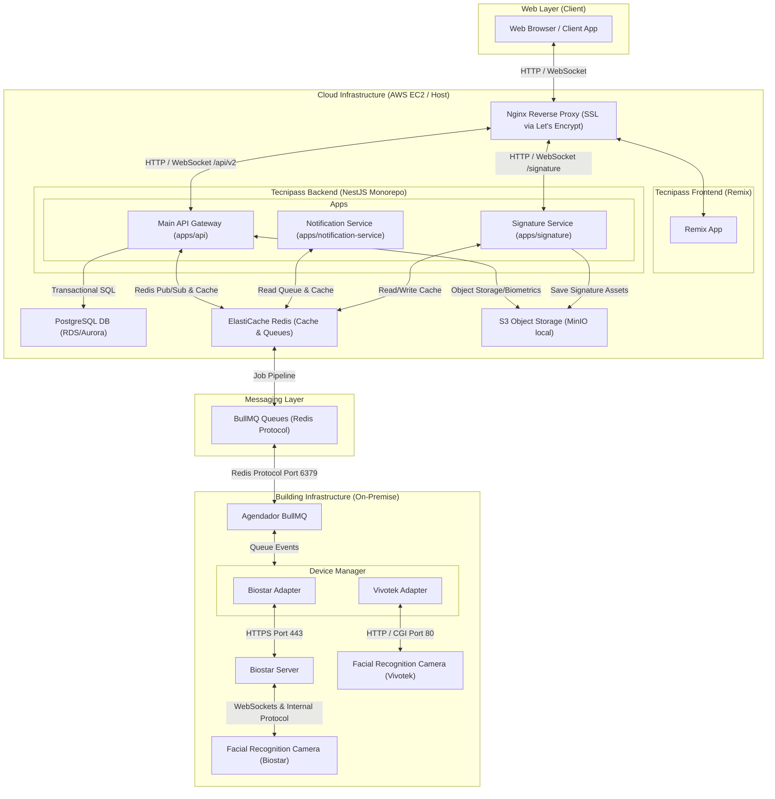

# Logical Architecture & Service Integration Specification (As-Is)

This specification details the logical structure, internal flows, connectivity mechanisms, queue topology, and physical integrations of the TecniPass platform, based on the DevOps Technical Document dated 2026-02-26. It serves as the single source of truth for backend services, logical interfaces, and hardware communication.

## Architectural Topology Diagram

The following diagram illustrates the deployment topology, data flow, and boundaries between the web clients, the AWS-hosted EC2 instance, the queue management system, and the physical building infrastructure.

---

## Rules & Guidelines

### 1. Monorepo Component Boundaries
- **`apps/api`**: Exposes public REST endpoints under `/api/v2`. Manages user authentication, session state, core business logic, real-time events, and coordinates physical access synchronization.
- **`apps/signature`**: Microservice specialized for capturing, processing, validating, and saving tactile and biometric digital signatures, utilizing Redis for caching and S3/MinIO for secure object storage.
- **`apps/notification-service`**: Standalone worker that consumes jobs from the `notifications` BullMQ queue. Sends emails via dynamic SMTP configurations or logs output to the console.
- **Shared Libraries (`backend/packages`)**:
  - `@tecnipass/biometric-core`: Common interfaces and standardized event contracts for biometric integration.
  - `@tecnipass/biostar-adapter`: Concrete Biostar vendor implementation handling HTTP REST, WebSockets, and device event publishing.
  - `@tecnipass/redis-client`: Shared Redis client wrapper enforcing type-safe error handling.
  - `@tecnipass/utility`: Common utility modules (e.g., monadic `Result` type, standardized logging layouts).

### 2. Messaging & Queue Infrastructure (Redis / BullMQ)
Any asynchronous communication between the API gateway, workers, and physical hardware must pass through BullMQ queues running on Redis. The table below represents the active queue topography:

| Queue Name | Producer | Consumer | Purpose |
| :--- | :--- | :--- | :--- |
| `notifications` | `apps/api` | `apps/notification-service` | Processing and dispatching emails (welcome, recovery, invitations). |
| `access-control-sync` | `apps/api` | `apps/api` (`AccessControlSyncWorker`) | Execution of scheduled grants and revocations of building access. |
| `property-people-cleanup`| `apps/api` | `apps/api` (`PropertyPeopleCleanupWorker`) | Daily cleanups (triggered at midnight by timezone) to purge expired users. |
| `device-events` | `Biostar Adapter` | `apps/api` (`DeviceEventsWorker`) | Listening to status changes, heartbeats, and dynamic device enrollment. |
| `person-events` | `Biostar Adapter` | *No active consumer* | Captures biometric user events (published but currently unconsumed). |

### 3. Execution Infrastructure (Docker Compose)
For local development, infrastructure services are orchestrated via Docker Compose:
- **PostgreSQL** (`port 5432`): High-integrity transactional storage.
- **Redis** (`port 6379`): Technical cache, sessions, and BullMQ backing store.
- **MinIO** (`ports 9000/9001`): S3-compatible local object storage.
- **API** (`port 3000`): Main REST/WebSocket engine (depends on Postgres, Redis, MinIO).
- **Notifications** (`port 3001`): Mail distribution worker (depends on Redis).

---

## Technical Workflows & Flows

### 1. HTTP Session & Authentication Flow
1. **Login**: Frontend sends a payload to `POST /api/v2/auth/email/login`. If valid, the API issues HTTP-only `session` and `refresh` cookies.
2. **REST Validation**: Axises on the frontend calls `/api/v2/...` with `withCredentials: true`. The backend verifies the session JWT via **EdDSA validation** utilizing public keys (`JWT_PUBLIC_KEY`).
3. **Session Refresh**: If a REST call yields a `401 Unauthorized` response, the frontend intercepts the request and issues a `POST /api/v2/auth/refresh` using the refresh cookie to rotate tokens. If the rotation fails, frontend state is wiped and the user is redirected to the login view.
4. **Logout**: Frontend issues `POST /api/v2/auth/logout` which invalidates tokens on Redis and clears cookie headers.

### 2. Real-Time Communication (WebSockets)
- Backend exposes a Socket.IO gateway under the namespace `/realtime`.
- Connection authentication is resolved via either:
  1. `handshake.auth.token` or `sessionToken`
  2. Authorization bearer header
  3. `session` cookie
- Domain events trigger real-time event emissions down to the client web socket, formatted under:
  - `user-role.*` (role changes, updates)
  - `meeting.*` (meeting schedules, updates)
  - `invitation.*` (visitor invitations)
  - `access-control.*` (access logs, scanner signals)

### 3. API <-> Biostar Hardware Integration
1. **Registration**: Properties define an `adapterConfig` object consisting of `{ vendor, host, username, password }`.
2. **Initialization**: The `FacialRecognitionAdapterManager` creates a `BiostarAdapter` instance in the background.
3. **Connectivity**:
   - `BiostarAdapter` starts a session and caches connection tokens in Redis.
   - Starts the `AutoDiscoverService` for network scanner discovery.
   - Connects to the Biostar Server WebSocket using `BiostarEventStreamService`.
4. **Synchronization**:
   - `PersonAdapterSyncService`: Triggered upon user role or invitation approval, syncs identities onto devices. Executes auto-reconciliation on backend startup.
   - `AccessControlSyncService`: Schedules access window jobs inside `access-control-sync`. Controls person status changes based on scheduling.

---

## Known Code Gaps & Technical Gaps (AI Context Alignment)

> [!WARNING]
> When modifying backend interfaces or implementing physical device synchronizations, align with these observations to avoid regressions:

1. **Real-Time Event Contract Mismatch**:
   - The frontend application contains active event listeners for `start_monitoring`, `biostar_event`, and `qr_code_updated`.
   - The modern `/realtime` backend gateway **does not** expose these specific event names, resulting in silent socket mismatches. Any websocket changes must address this schema inconsistency.
2. **Missing Vendor Implementations**:
   - The design specifies a `VivotekAdapter` for Vivotek-brand facial recognition cameras.
   - The codebase currently **lacks** any active implementation of Vivotek under `backend/apps` or `backend/packages`. The system currently only integrates `biostar`.
3. **Dead Queue Output**:
   - Biometric person events are correctly published to the `person-events` queue by the `@tecnipass/biostar-adapter`, but there is **no consumer worker** registered for this queue.
4. **Security Configuration in Biostar API**:
   - The Biostar HTTP and WS client initialization is configured with `rejectUnauthorized: false`. This must be addressed when migrating to strict production environments.
5. **Shallow Health Checks**:
   - The endpoint `GET /api/v2/health` responds with a static payload and does not perform active dependency verification (Postgres, Redis, or device server reachability).
6. **VPN and Traffic Constraints**:
   - BullMQ scheduling may experience high transaction spikes of up to **2000 requests per second** during peak entry/exit windows (8:00 AM & 5:00 PM).
   - Currently, there are no VPN bandwidth parameters, redundancy specifications, or connection limits documented for on-premise hardware VPN connections.
