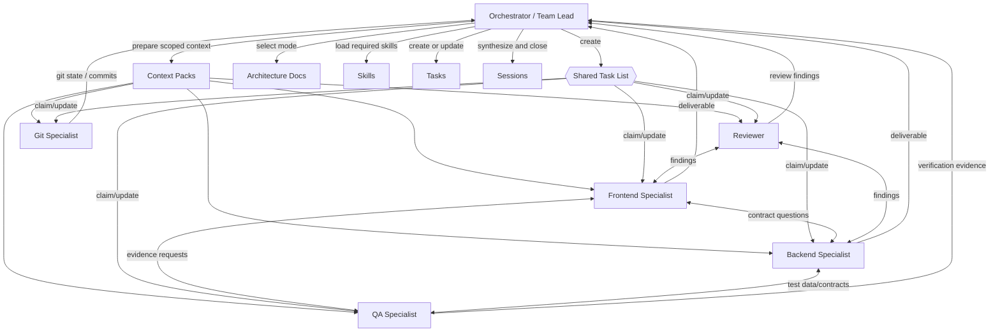

# Parallel Agent Architecture

## Classification
This document is not an agent and not a feature specification.

It is an operational architecture foundation. It defines the theory, logical model, coordination framework, tool mapping, and execution rules for multi-agent work in the TecniPass harness.

Use it when the Orchestrator must decide how to distribute work across sequential execution, fork-join subagents, or collaborative Agent Teams.

## Core Principle
The workflow is provider-agnostic. The Orchestrator defines the contract; each provider-specific tool decides how to execute it.

Preferred model for complex work: **Agent Teams**, based on the Claude-style pattern:
- one lead Orchestrator;
- a shared task list;
- specialist agents with scoped context packs;
- progress reports;
- cross-agent communication when useful;
- Orchestrator synthesis and final verification.

If native Agent Teams are unavailable, emulate the same contract with subagents, sequential handoffs, or manual task partitioning.

## Required Companion Protocols
When this protocol is active, load only the companion protocols needed by the current phase:

| Phase | Protocol | Purpose |
|---|---|---|
| Before planning | `protocols/charter-preflight.protocol.md` | Clarify objective, constraints, assumptions, and blockers. |
| Task decomposition | `protocols/task-board.protocol.md` | Create the Shared Task List and ownership schema. |
| Context assembly | `protocols/context-budget.protocol.md` | Prevent overloading specialists with irrelevant context. |
| Validation | `protocols/verification-retry.protocol.md` | Verify, retry, and escalate failures. |
| Session persistence | `protocols/decision-log.protocol.md` | Preserve decisions and progress that future agents need. |

## Topologies

### Sequential Execution
One agent performs the full lifecycle.

Use when:
- tasks are tightly coupled;
- several subtasks edit the same files;
- a decision must be made before downstream work can start;
- the work is small enough that orchestration overhead would dominate.

### Fork-Join Subagents
The Orchestrator splits independent work into isolated subtasks. Subagents do not coordinate laterally; they report results back to the Orchestrator.

Use when:
- tasks are independent;
- each subtask has clear file ownership;
- output can be merged by the Orchestrator;
- communication between specialists is unnecessary.

### Agent Teams
The Orchestrator acts as team lead. Specialists work from a shared task list, report progress, coordinate when dependencies appear, and produce verifiable deliverables.

Use when:
- multiple roles must collaborate;
- there are competing hypotheses to investigate;
- specialists need to share findings;
- QA or review must run while implementation work continues;
- the final answer requires synthesis across several perspectives.

## Logical Model



## Orchestrator Contract
The Orchestrator is the single leader for a multi-agent session.

Responsibilities:
1. Run Charter Preflight.
2. Define the objective, scope, constraints, risks, and done criteria.
3. Detect available execution capabilities from the current environment.
4. Select sequential, subagent, or Agent Team mode.
5. Create the shared task list before dispatching work.
6. Assign owners and file scopes.
7. Build minimal context packs for each specialist.
8. Prevent parallel edits to the same file or contract.
9. Require progress reports and unblock dependencies.
10. Collect deliverables, QA evidence, review findings, and git status.
11. Synthesize the final result and update task/session records.

The Orchestrator must not implement code while waiting for specialist results that determine the correct path.

## Shared Task List
Every Agent Team session must have a shared task list.

Recommended location:
- active work: `tasks/active/{task-id}.task.md`
- handoff or continuation: `sessions/{date}-{topic}.snapshot.md`

Task schema:

```md
## Shared Task List

| ID | Status | Owner | Scope | Files | Deliverable | Dependencies |
|---|---|---|---|---|---|---|
| T1 | pending | frontend | UI state and form behavior | app/routes/... | Patch + validation notes | none |
| T2 | pending | backend | API contract review | src/... | Contract summary | T1 |
```

Allowed statuses:
- `pending`
- `in_progress`
- `blocked`
- `review`
- `done`

Rules:
- one owner per task at a time;
- each task must have a concrete deliverable;
- each task must declare file scope;
- a task editing shared contracts must be serialized;
- blocked tasks must state the blocking condition and required input.

## Context Packs
A context pack is the minimum useful context a specialist needs.

Each context pack must include:
- objective;
- assigned task ID;
- relevant requirement or user instruction;
- allowed files and forbidden files;
- required skills;
- relevant architecture/protocol links;
- known risks or previous mistakes;
- expected deliverable format;
- validation expectations.

Do not include full repository context unless the specialist genuinely needs it.

## Specialist Roles

### Frontend Specialist
Owns UI, client-side logic, routing, forms, state, and frontend validation.

Required context usually includes:
- frontend architecture;
- UI/Tailwind rules;
- TanStack form rules when forms are involved;
- component and route files in scope.

### Backend Specialist
Owns API, domain logic, persistence, DTOs, migrations, services, and backend tests.

Required context usually includes:
- backend architecture;
- logical services architecture;
- API contract expectations;
- database or migration scope.

### QA Specialist
Owns reproducibility, validation evidence, acceptance criteria, and regression risk.

Required context usually includes:
- task acceptance criteria;
- test commands;
- expected user flows;
- known bugs and edge cases.

### Reviewer
Owns review findings, regressions, maintainability risks, security risks, and missing tests.

Required context usually includes:
- changed files;
- task scope;
- conventions;
- known mistakes.

### Git Specialist
Owns Git inspection, branch comparison, commit planning, rebase support, and final commit hygiene.

Required context usually includes:
- `agents/git-master.agent.md`;
- `skills/git-master/SKILL.md`;
- only the git reference needed for the active operation.

## Communication Rules
Specialists may communicate only when it reduces risk or removes a dependency.

Allowed communication:
- frontend asks backend to confirm response shape;
- backend asks QA for fixture data;
- QA asks frontend for a reproducible route/state;
- reviewer asks implementer to clarify intent;
- git specialist asks Orchestrator to confirm staging boundaries.

Not allowed:
- open-ended discussion without a decision request;
- two specialists claiming the same file;
- side decisions that bypass the Orchestrator;
- closing a task without evidence.

## Tool Mapping
The Orchestrator must detect capabilities by available tools, not by provider brand.

Priority:
1. Native Agent Teams or shared multi-agent sessions.
2. Native subagents with isolated context.
3. Parallel tool calls for read-only discovery.
4. Sequential emulation with explicit handoffs.

Provider-specific features may be used only as implementations of this architecture. The workflow remains unchanged.

## File Ownership And Conflict Control
Before dispatch:
1. List files each task may edit.
2. Mark shared contracts and generated files.
3. Serialize any task that touches the same file or contract.
4. Require Orchestrator approval before expanding file scope.

If overlap appears during execution:
1. pause the affected tasks;
2. assign one owner;
3. merge context into that owner;
4. resume dependent tasks after the owner reports completion.

## Operating Sequence
1. Load `AGENTS.md`, `env.json`, active task/spec, and execution mode protocol.
2. If parallel or team mode is selected, load this protocol document.
3. Run Charter Preflight.
4. Create the session charter: objective, scope, constraints, roles, done criteria.
5. Create the shared task list.
6. Create context packs with context budget rules.
7. Dispatch specialists using available provider tools.
8. Collect progress reports.
9. Resolve dependencies and conflicts.
10. Run QA and review.
11. Apply verification and retry rules where checks fail.
12. Log durable decisions.
13. Synthesize final output.
14. Update `tasks/`, `sessions/`, and `memory/` when relevant.

## Done Criteria
A multi-agent session is done only when:
- every shared task is `done` or explicitly deferred;
- blocked tasks have documented reasons;
- all deliverables are synthesized by the Orchestrator;
- QA/review evidence exists when code changed;
- git state is known;
- session/task documentation is updated when required.

## Risk Signals
Switch to sequential execution or replan when:
- two specialists need the same file;
- the task list has vague deliverables;
- a specialist needs full repository context to continue;
- contracts are changing without a single owner;
- QA lacks enough evidence to validate;
- the Orchestrator cannot state the done criteria in one sentence.
