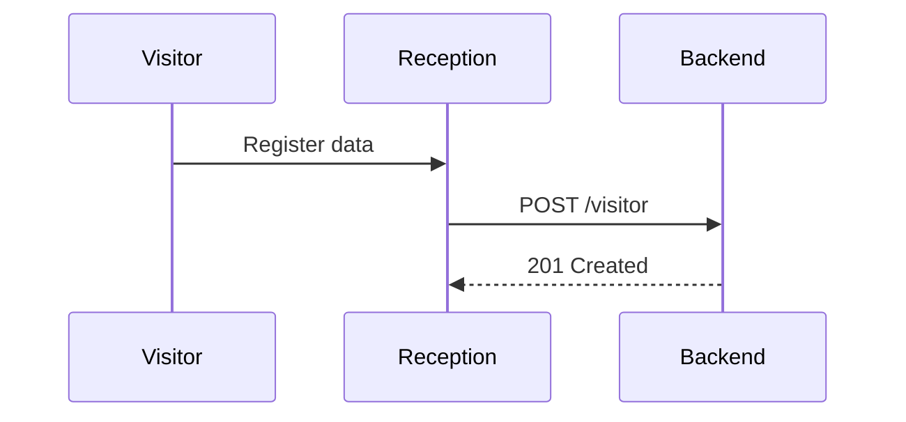

# Specification: {ID} - {Module Or Feature Title}

> One concise sentence describing the purpose of this document.

## 1. Context And Objective
Describe the business problem, reason for the change, and expected value in no more than five lines.

## 2. Scope

### Included
- [ ] Functional requirement A.
- [ ] Functional requirement B.

### Excluded
- [ ] Out-of-scope item X.
- [ ] Out-of-scope item Y.

## 3. Functional Requirements
Each requirement must be verifiable.

1. **FR-01**: When the user clicks X, Y must happen.
2. **FR-02**: The system must validate Z before submitting.
3. **FR-03**: On screens below 768px, element A must behave as specified.

## 4. Data Contracts
Use TypeScript types, JSON payloads, or schema notes as needed.

### Request Payload

```json
{
  "field": "value"
}
```

### Response Payload

```json
{
  "success": true
}
```

### Validation Rules
- `field`: required, minimum length 3 characters.

## 5. Acceptance Criteria

### Scenario 1: Successful Flow
- **Given**: The user is authenticated and on screen X.
- **When**: The user completes valid fields and submits.
- **Then**: A success message appears and the form resets.

### Scenario 2: Validation Error
- **Given**: The user is on the form.
- **When**: The user submits empty required fields.
- **Then**: Inline error messages appear for the affected fields.

## 6. Design Decisions

| Decision | Alternatives Considered | Rationale |
|---|---|---|
| Use component A | Build a custom component | Reuses existing style and behavior. |

## 7. Affected Files
Use paths relative to the repository root.

- `frontend/app/routes/_home.module/route.tsx`
- `backend/src/features/module/module.controller.ts`

## 8. Dependencies And Impact
- Database migration:
- Environment variables:
- Shared components:
- API contracts:

## 9. UI References
Use screenshots, Excalidraw links, or Mermaid diagrams when useful.


