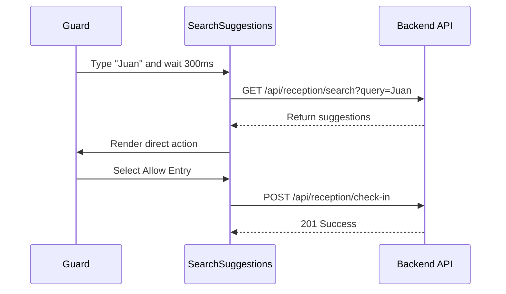

# Specification: TEC-495 - Improve Reception Search Flow

> Example specification for debounced reception visitor search with direct actions.

## 1. Context And Objective
Reception guards currently need to type a full visitor name and submit a search manually. This creates delays during peak hours. The feature adds debounced autocomplete suggestions and direct actions for valid invitations.

## 2. Scope

### Included
- [x] Reactive search input with 300ms debounce.
- [x] Floating suggestion list with visitor name, invitation state, and destination.
- [x] Direct actions such as `Allow Entry` and `View Details`.
- [x] TanStack Query state management for the search API.

### Excluded
- [ ] QR scanning.
- [ ] Full visitor registration from the search bar.

## 3. Functional Requirements
1. **FR-01**: After at least three characters, the system must call the backend after 300ms of typing inactivity.
2. **FR-02**: Suggestions must render below the search input.
3. **FR-03**: Approved visitors must show a direct check-in action.
4. **FR-04**: On screens below 768px, the suggestions must fit the viewport without overflow.

## 4. Data Contracts

### Query Endpoint
`GET /api/reception/search?query={search_term}`

### Response Payload

```json
[
  {
    "id": "uuid-visitor-1",
    "fullName": "Juan Perez",
    "status": "APPROVED",
    "destinationUnit": "Tower A - 402",
    "invitationId": "uuid-invitation-1"
  }
]
```

### Validation Rules
- `query`: required string, minimum length 3 characters.

## 5. Acceptance Criteria

### Scenario 1: Successful Search
- **Given**: The guard is on the reception home screen.
- **When**: The guard types `Juan` and waits 300ms.
- **Then**: Suggestions include the visitor name, approved state, destination, and direct check-in action.

### Scenario 2: Direct Check-In
- **Given**: Suggestions are open.
- **When**: The guard selects the direct check-in action.
- **Then**: The backend request is sent, success feedback appears, suggestions close, and reception history refreshes.

## 6. Design Decisions

| Decision | Alternatives Considered | Rationale |
|---|---|---|
| Use TanStack Query | Local `useEffect` fetch | Reuses cache, loading, and refetch conventions. |
| Client debounce at 300ms | Server-only debounce | Reduces unnecessary backend calls. |

## 7. Affected Files
- `frontend/app/routes/_home.reception/components/SearchSuggestions.tsx`
- `frontend/app/routes/_home.reception/route.tsx`
- `backend/src/features/reception/reception.controller.ts`
- `backend/src/features/reception/use-cases/search-visitor.use-case.ts`

## 8. Dependencies And Impact
- Reception backend module exposes the search endpoint.
- Database search performance may require an indexed visitor name field.

## 9. Sequence Diagram


